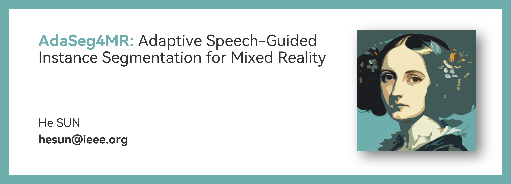
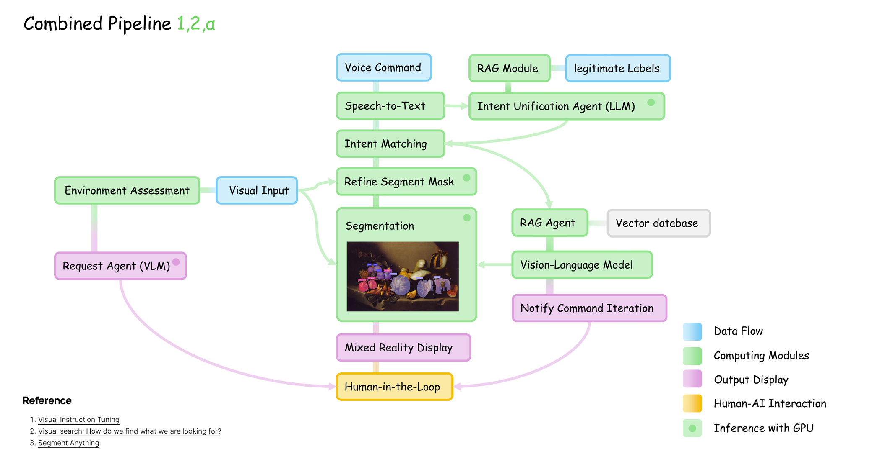

# AdaSeg4MR

This project develops an innovative mixed reality (MR) interaction pipeline that integrates real-time semantic segmentation and natural language interaction for dynamic object tracking and image segmentation.  It aims to create a more intuitive and immersive experience for users interacting with virtual and real-world environments.

## Project Goals

* **Advanced Semantic Segmentation:** Leverage state-of-the-art models like the Segment Anything Model (SAM) and FastSAM to achieve accurate and adaptable object recognition in varying conditions.
* **Natural Language Interaction:** Implement a natural language processing (NLP) module to interpret user voice commands related to object tracking and image segmentation, enabling real-time responses and seamless interaction.
* **Intuitive User Interface:** Design a user-friendly mixed reality interface for visualizing segmented objects and interacting with them using natural language.
* **Real-Time Synchronization:** Optimize synchronization between NLP and computer vision models to ensure efficient, real-time interaction and minimize latency.
* **Environmental Robustness:** Address challenges posed by variable lighting, object occlusion, and rapid object movement in real-time MR environments.
* **User-Guided Visual Search:** Support user-guided visual searches within an egocentric perception framework for more immersive and intuitive interactions.
* **Novel Computer Vision Approaches:** Explore innovative real-time semantic segmentation implementations, such as visual Retrieval-Augmented Generation (RAG) and multimodal prompting.

## System Architecture and Distribution Plan

Due to limited computing resources, the project employs a distributed computing strategy.  This plan may be adjusted if additional resources are secured.

### Google Colab

* **Segmentation Models (YOLOv11-Seg, GroundedSAM, POSE):** Deployed on Tesla T4 GPUs for high-performance image segmentation.  Careful management of thread switching and inter-process communication is crucial due to shared hardware resources.

### Local Computing

* **Unity Rendering and Local Inference:** Handled by an RTX 3060 GPU.
* **LangChain and RAG tasks:** Processed by an Intel i7 CPU.
* Thread switching is employed to manage concurrent tasks efficiently.

### API Utilization

* **Vector Database:** Hosted on Pinecone for scalability and efficiency.
* **Visual Language Model, Toolchain Agent, Automatic Speech Recognition (ASR), and Text-to-Speech (TTS):** Powered by Groq LPUs for high-throughput and low-latency language processing. These services operate independently and efficiently, minimizing thread switching.

## Technologies Used

* **Semantic Segmentation Models:** Segment Anything Model (SAM), FastSAM, YOLOv11-Seg, GroundedSAM, POSE
* **Natural Language Processing:** LangChain, RAG
* **Vector Database:** Pinecone
* **Hardware:** Tesla T4 GPUs, RTX 3060 GPU, Intel i7 CPU, Groq LPUs
* **Mixed Reality Platform:** Unity
